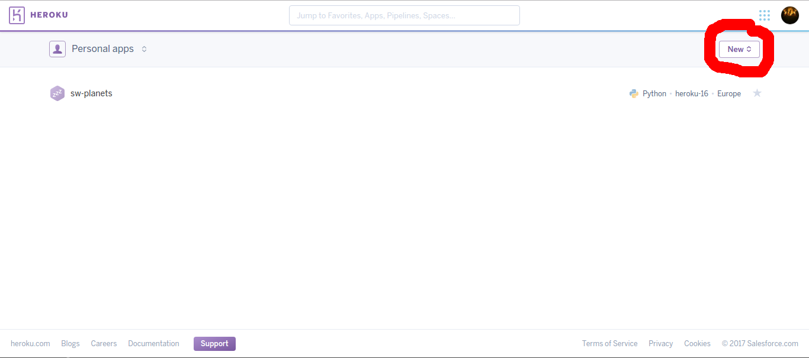
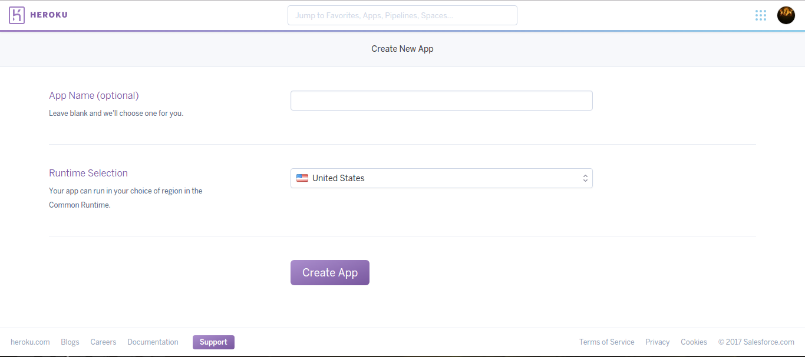

# Deploying a Flask app to Heroku

## Table of contents

1. [Create an account on Heroku](#create-an-account-on-heroku)
1. [Create an app on Heroku](#create-an-app-on-heroku)
1. [Install the Heroku CLI](#install-the-heroku-cli)
1. [Install the gunicorn package](#install-the-gunicorn-package)
1. [Create config files](#create-config-files)
1. [Deploy the app with git](#deploy-the-app-with-git)

## Create an account on Heroku

Create an account on [Heroku](https://www.heroku.com/).

Activate your account with the link in the email they send you.

## Create an app on Heroku

Create a new app on the dashboard.

On the next screen you can select a region and type in a name if you don't want Heroku to generate you one.

## Install the Heroku CLI

## Install the gunicorn package

## Create config files

## Deploy the app with git